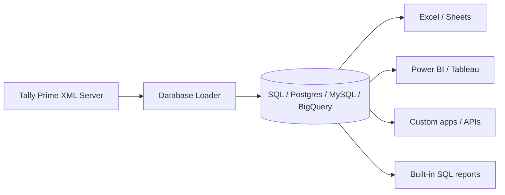

# What data we extract from Tally — and how to use it

## The big picture

Tally stores data in a **hierarchical, proprietary** format (tables inside tables). This loader talks to Tally's **XML Server**, pulls collections via TDL field mappings (`tally-export-config.yaml`), and **flattens** them into normal relational tables (`mst_*` masters + `trn_*` transactions) so you can query them in SQL Server / MySQL / PostgreSQL / BigQuery or feed **Excel, Power BI, Tableau**, etc.



Two mental models matter most:

| Concept | Meaning |
|---|---|
| **`mst_*`** | Masters (ledgers, items, groups, employees…) — relatively stable |
| **`trn_*`** | Transactions (vouchers and line effects) — high volume, time-based |
| **Primary** | Real Tally objects (e.g. `trn_voucher`) |
| **Derived** | Flattened sub-tables (e.g. ledger lines → `trn_accounting`, stock lines → `trn_inventory`) |
| **`guid`** | Primary key / join key (voucher header links to all its lines via `guid`) |
| **`is_*` fields** | Booleans stored as `0`/`1` (tinyint), not true SQL `bit` everywhere |

---

## End-to-end flow

1. App/config sets company, date range (`auto` or explicit), sync mode (`full` / `incremental`).
2. Loader builds TDL/XML requests from `tally-export-config.yaml` (or `*-incremental.yaml`).
3. Tally returns XML; loader converts to CSV/rows and inserts/bulk-loads into your DB.
4. You run SQL (or connect BI tools) against the tables.

**Critical conventions in amounts & quantities**

| Field | Convention |
|---|---|
| `trn_accounting.amount` | **Negative = Debit**, **Positive = Credit** |
| `trn_inventory.quantity` | **Negative = Outward**, **Positive = Inward** |
| Relationships | **Not enforced as FKs** (faster bulk load); join in SQL/BI yourself |
| Join style | Mostly by **name** for masters (`ledger`, `item`, `voucher_type`), by **`guid`** for voucher lines |

---

## What gets extracted (by domain)

### 1. Chart of accounts & parties (`mst_*`)

| Table | Source in Tally | What it holds | Typical use |
|---|---|---|---|
| `mst_group` | Group | Account group tree, revenue flags, sort order | Trial balance / P&amp;L hierarchy, group filters |
| `mst_ledger` | Ledger | Ledgers: balances, GSTIN, PAN, bank details, addresses, credit period | Party master, TB, GST party reports, debtors/creditors |
| `mst_vouchertype` | VoucherType | Sales/Purchase/Payment/… + parent type, stock impact | Classify vouchers (sales register filters on `parent in ('Sales')`) |
| `mst_uom` | Unit | Units & conversions | Stock qty normalization |
| `mst_godown` | Godown | Warehouses | Stock by location |
| `mst_stock_group` | StockGroup | Item categories | Inventory rollups |
| `mst_stock_item` | StockItem | Items: UOM, opening/closing qty & value, GST/HSN, rates | Stock summary, item master, GST HSN reports |
| `mst_cost_category` / `mst_cost_centre` | CostCategory / CostCentre | Cost dimensions | Department / project P&amp;L |
| `mst_employee` / `mst_payhead` / `mst_attendance_type` | CostCentre (employee nature), Payhead, AttendanceType | Payroll masters | Payroll & attendance analytics |
| `mst_gst_effective_rate` | StockItem.GstDetails | Effective GST rates by item/date | Tax rate history |
| `mst_opening_*` | Opening bill/batch allocations | Opening receivables/payables & batches | Opening balances, AR/AP starting point |
| `mst_stockitem_standard_cost` / `_price` | Standard cost/price lists | Planned cost/price | Margin vs standard |
| `trn_closingstock_ledger` | Ledger closing stock values | Closing stock in accounts | P&amp;L / balance sheet alignment |
| `config` | Loader metadata | Sync state (esp. incremental) | Ops / monitoring |

**Ledger is the richest master** — not just balances, but **GST, bank, mailing, tax** fields — so it doubles as a **customer/vendor/CRM-lite** extract.

---

### 2. Transactions — voucher spine

Everything transactional hangs off **`trn_voucher`** (one row per voucher/header):

| Column (examples) | Meaning |
|---|---|
| `guid` | Unique voucher id — join key to all line tables |
| `date`, `voucher_type`, `voucher_number` | Core document identity |
| `reference_number` / `reference_date` | Party/ref invoice refs |
| `narration` | Remarks |
| `party_name`, `place_of_supply` | Counterparty & GST place |
| `is_invoice`, `is_accounting_voucher`, `is_inventory_voucher`, `is_order_voucher` | Flags to include/exclude in financial vs stock vs order reports |

Line effects (derived from voucher sub-tables):

```
trn_voucher (header)
 ├── trn_accounting          ← debit/credit per ledger
 │    ├── trn_cost_centre
 │    ├── trn_cost_category_centre
 │    ├── trn_bill           ← bill-wise (AR/AP)
 │    └── trn_bank           ← cheque/NEFT allocations
 ├── trn_inventory           ← item qty/rate/amount per line
 │    └── trn_batch          ← godown / batch / tracking
 ├── trn_inventory_accounting
 ├── trn_cost_inventory_category_centre
 ├── trn_employee / trn_payhead / trn_attendance  ← payroll-ish entries
```

| Table | Grain | Business meaning |
|---|---|---|
| `trn_accounting` | Voucher × ledger line | Double-entry effects; basis for TB, P&amp;L, registers |
| `trn_inventory` | Voucher × item line | Sales/purchase/stock movement lines |
| `trn_bill` | Voucher × ledger × bill ref | Bill-wise outstanding (receivable/payable tracking) |
| `trn_bank` | Voucher × bank allocation | Instrument no/date, bank name, amount |
| `trn_batch` | Inventory × godown/batch | Warehouse & batch traceability |
| `trn_cost_*` | Accounting/inventory × cost centre | Segment reporting |
| `trn_employee` / `trn_payhead` / `trn_attendance` | Payroll/attendance vouchers | HR/payroll reporting |

---

## How you actually use this data

### A. Out-of-the-box financial & operational reports (SQL included)

Under `electron-app/reports/mssql/` (and similar for BigQuery) you already have Tally-style reports implemented as SQL on this model:

| Report file | Business question |
|---|---|
| `trial-balance.sql` | Opening + period debit/credit + closing per ledger |
| `profit-loss.sql` | Income & expense for a period |
| `sales-register.sql` / `sales-daily.sql` / `sales-monthly.sql` | Sales by voucher/day/month (party, GSTIN, ledgers) |
| `purchase-register.sql` (+ daily/monthly) | Purchase analysis |
| `account-ledger.sql` | Ledger statement |
| `bills-receivable.sql` / `bills-payable.sql` | Outstanding bills (ageing base) |
| `daily-cash-movement.sql` | Cash/bank movement |
| `stock-summary.sql` / `stock-voucher-view.sql` | Stock position & movements |
| `accounting-voucher-view.sql` | Flattened accounting voucher view |
| `group-tree-*.sql` | Account group hierarchies |

Pattern is always: **`trn_voucher` + `trn_accounting`/`trn_inventory` + masters**, filtered by `voucher_type` parent (`Sales`, `Purchase`, etc.) and/or date range.

Example pattern (sales register logic):

```sql
-- Conceptually (see reports/mssql/sales-register.sql)
SELECT v.date, v.voucher_number, v.party_name, a.ledger, a.amount
FROM trn_accounting a
JOIN trn_voucher v ON v.guid = a.guid
JOIN mst_vouchertype t ON v.voucher_type = t.name
WHERE t.parent IN ('Sales')
  AND a.ledger <> v.party_name;  -- exclude party control line if needed
```

Trial balance idea: sum `trn_accounting` before period for opening movement, sum within period split debit/credit by sign of `amount`, combine with `mst_ledger.opening_balance` for non-revenue ledgers.

---

### B. Dashboards & BI (Power BI / Tableau / Looker Studio)

Load the DB (or CSV/BigQuery export) and model relationships as in [docs/data-structure.md](docs/data-structure.md):

**Star-ish model you can build**

- **Fact:** `trn_accounting` (with `trn_voucher` for date/type/party)
- **Fact:** `trn_inventory` (sales/purchase qty & value)
- **Dim:** `mst_ledger`, `mst_group`, `mst_stock_item`, `mst_vouchertype`, date dimension from `trn_voucher.date`

**High-value dashboards**

| Dashboard | Main tables |
|---|---|
| Sales trend & top customers | `trn_voucher` + `trn_accounting` + `mst_ledger` |
| Purchase & supplier spend | Same, filter purchase voucher types |
| Receivables / payables ageing | `trn_bill` + `trn_voucher` + `mst_ledger` (credit period) |
| Inventory turnover / stock value | `trn_inventory` + `mst_stock_item` + `trn_batch` |
| GST exposure (basic) | Ledgers GSTIN + sales/purchase registers + HSN on items |
| Cost centre profitability | `trn_cost_category_centre` / `trn_cost_centre` |
| Cash & bank position | `trn_bank` + cash/bank ledgers in `trn_accounting` |

Tips for BI:

- Create a **Date** table from min/max `trn_voucher.date`.
- Treat `amount < 0` as debit measures (`ABS` for debit, positive as credit).
- Exclude `is_order_voucher = 1` when you want only posted accounting (see trial-balance report).
- Exclude pure inventory vouchers (`is_inventory_voucher`) when doing financial TB if appropriate.

---

### C. Excel / Google Sheets

- Connect to SQL / export CSV mode (`technology: csv`) and pivot:
  - Sales by month/customer
  - Expense by ledger group
  - Stock valuation
- Use for auditors/accountants who won't touch Power BI.
- Loader was explicitly aimed at **tabular reports in Excel/Sheets** and **dashboards in Power BI/Tableau/Data Studio**.

---

### D. Compliance, GST, banking (master-enriched)

Not a full GSTR engine, but you can support:

| Need | Where data lives |
|---|---|
| Party GSTIN / registration type | `mst_ledger.gstn`, `gst_registration_type`, `gst_supply_type` |
| HSN / tax rate on items | `mst_stock_item.gst_hsn_code`, `gst_rate`, `mst_gst_effective_rate` |
| Place of supply on invoices | `trn_voucher.place_of_supply` |
| Bank payouts / receipts | `trn_bank` (+ instrument numbers/dates) |
| PAN / addresses | `mst_ledger.it_pan`, mailing_* fields |

Useful for **internal GST reconciliations**, export packs, or feeding another compliance tool—not a replacement for Tally's statutory returns by itself.

---

### E. Operations & inventory

| Need | Approach |
|---|---|
| Stock summary by item | `mst_stock_item` closing fields **or** sum `trn_inventory` with signs |
| Godown-wise stock | `trn_batch` + `mst_godown` |
| Fast/slow movers | Aggregate `trn_inventory` by item over period |
| Orders vs invoices | Filter `trn_voucher.is_order_voucher` vs normal invoices |
| Margin (basic) | Sales lines vs purchase/cost; standard cost tables for planned margin |

---

### F. Payroll / HR (if you use Tally payroll features)

`mst_employee`, `mst_payhead`, `trn_employee`, `trn_payhead`, `trn_attendance` support:

- Salary register reconstruction
- Payhead cost by employee
- Attendance vs pay correlation

Only valuable if the Tally company actually maintains these; otherwise tables stay empty/sparse.

---

### G. Application / integration use cases

Once in SQL Server (or other DB), you can:

1. **Internal MIS portal** — REST API over SQL views (sales today, outstanding, stock alerts).
2. **Alerts** — scheduled queries: bills overdue (`trn_bill` + credit period), negative stock, sales drop.
3. **Multi-company consolidation** — one DB/schema per company (`--database-schema`), then union views for group reporting.
4. **Incremental near-real-time** — `sync: incremental` + frequency (minutes) for RDBMS only; keeps DB close to live Tally without full reload.
5. **Data warehouse / lake** — BigQuery or ADLS/CSV for analytics pipelines and ML (forecasting demand, churn-ish party behaviour).

---

## Full vs incremental — what that means for usage

| Mode | What you get | Best for |
|---|---|---|
| **Full** | Wipe/reload (or full period extract) | Clean snapshots, audits, FY-end extracts, simplicity |
| **Incremental** | Only changed masters/vouchers since last sync (`_diff`, `_delete`, alter ids in incremental schema) | Ongoing dashboards, ops dashboards, lower load |

Incremental needs:

- Incremental DDL (`database-structure-incremental.sql`)
- Fixed company name in config
- No manual DELETE/TRUNCATE of target data
- Prefer single FY; from/to dates are effectively `auto`

---

## Practical "starter kit" queries / workflows

**1. Validate load**
```sql
SELECT COUNT(*) FROM trn_voucher;
SELECT MIN(date), MAX(date) FROM trn_voucher;
SELECT voucher_type, COUNT(*) FROM trn_voucher GROUP BY voucher_type ORDER BY 2 DESC;
```

**2. Sales total by month** (accounting basis)
- Join `trn_voucher` ↔ `trn_accounting` ↔ `mst_vouchertype` where parent is Sales; sum amounts carefully (often sum party line or income lines depending on report style — mirror `sales-register.sql`).

**3. Outstanding receivables**
- Start from `reports/mssql/bills-receivable.sql`; extend with `DATEDIFF` for ageing buckets (0–30, 31–60, …).

**4. Trial balance for a FY**
- Parameterize `@fromDate` / `@toDate` in `trial-balance.sql`.

**5. Power BI**
- Import all `mst_*` + `trn_voucher` + `trn_accounting` + `trn_inventory` first (core 80% of use cases); add bill/bank/batch when you need AR/AP/stock depth.

---

## Gaps & caveats (so expectations stay realistic)

1. **Not a live OLTP replacement for Tally** — it's an analytical/operational replica, lagging by last sync.
2. **No DB-enforced FKs** — bad joins or renamed ledgers in Tally can orphan lines; always join carefully.
3. **Name-based master joins** — if a ledger is renamed in Tally, historical lines may still carry old names depending on how Tally stores them; GUID is only on some entities.
4. **Sign conventions** — debit/credit and in/out are sign-based; easy to double-count if you don't follow the report SQL patterns.
5. **GST/statutory** — good for analysis & reconciliation; not certified e-filing output.
6. **Orders vs accounting** — filter `is_order_voucher` / `is_inventory_voucher` or financial reports will distort.
7. **One company → one schema/DB** is the intended multi-company pattern; don't mix companies in one schema without discipline.
8. **Tally.ERP9 dropped** — aligned to **Tally Prime**.

---

## Recommended adoption path

| Phase | Goal | What to use |
|---|---|---|
| **1. Trust the data** | Match Tally TB / sales register totals | `trial-balance.sql`, `sales-register.sql` vs Tally screens |
| **2. Accountant self-serve** | Excel pivots | Views or direct SQL extracts |
| **3. Management dashboards** | Daily sales, outstanding, stock | Power BI on `trn_*` + `mst_*` |
| **4. Ops automation** | Overdue bills, low stock | Scheduled SQL + alerts |
| **5. Scale** | Multi-company, cloud BI | Per-company DB + BigQuery/warehouse |
| **6. Near-live** | Keep DB fresh | Incremental sync on RDBMS |

---

## Summary

You are extracting a **relationalized mirror of Tally Prime**: full **chart of accounts & inventory masters** (with GST/bank/address richness), plus **voucher headers and fully exploded accounting, inventory, bill-wise, bank, cost-centre, and payroll lines**. That unlocks everything Tally's UI does slowly or one-company-at-a-time—but in **SQL, Excel, and BI at scale**: financial statements, sales/purchase analysis, receivables/payables, stock, cost centres, and light GST/bank ops reporting.

If you want to go deeper next, we can pick one track and make it concrete:

1. **Map your real Tally company** → which tables will be populated vs empty  
2. **Design a minimal Power BI model** (tables + relationships + 5 starter measures)  
3. **Write/adapt SQL** for one target report you care about (e.g. ageing, MIS sales vs budget, multi-branch stock)

Tell me your primary goal (MIS dashboards, statutory support, multi-company, inventory, etc.) and target DB (SQL Server is fine), and we can drill into that path only.
